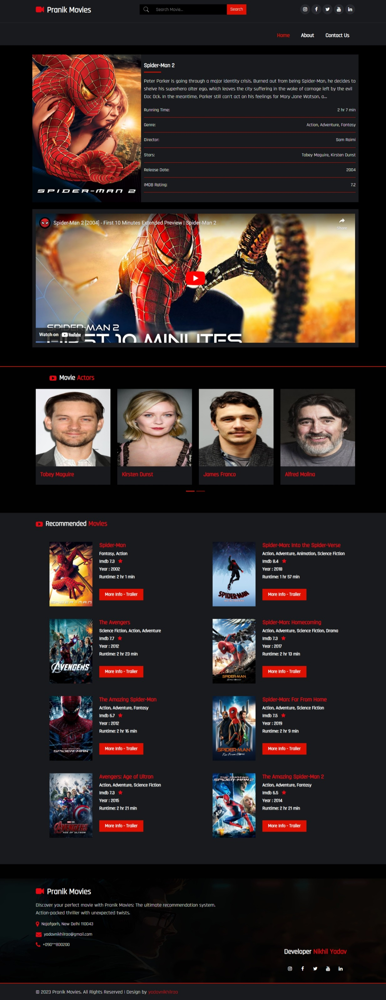

# Pranik Movies

Welcome to Pranik Movies! This is a web application for searching and exploring movies.

## Description

Pranik Movies is a user-friendly web application designed to help you search and discover your favorite movies. With a vast database of movies, you can easily find information about different films, watch trailers, and get details such as release date, cast, and ratings.

## Features

- **Movie Search:** Search for movies by their title and get instant results. The search functionality allows you to find movies quickly and efficiently.

- **Movie Details:** Get detailed information about each movie, including its title, genre, release date, runtime, director, cast, and a brief overview. This helps you make informed decisions about which movies to watch.

- **Trailers:** Watch trailers of movies directly on the website. If a movie has a trailer available, you can easily access and enjoy it.

- **Pagination:** Navigate through different pages of the application to explore a wide range of movies. The pagination feature ensures smooth browsing and easy access to multiple movies.

- **Social Media Integration:** Connect with Pranik Movies on social media platforms such as Twitter, Instagram, and Facebook to stay updated with the latest movie news, recommendations, and releases.

## Screenshots

### Home Page

### Search Results

## Contributing

Contributions are welcome! If you find any issues or have suggestions for improvements, please open an issue or submit a pull request.

## Project Links

- **Repository:** [https://github.com/yadavnikhilrao/The-Ultimate-Movies-Recommendation-System-V-2-Pranik-Movies](https://github.com/yadavnikhilrao/The-Ultimate-Movies-Recommendation-System-V-2-Pranik-Movies)
- **Live Demo:** [https://pranik.pythonanywhere.com/](https://pranik.pythonanywhere.com/)

## Contact

- **Website:** [https://pranik.pythonanywhere.com/](https://pranik.pythonanywhere.com/)
- **Email:** pranikmovies@gmail.com
- **Follow us on Twitter:** [https://twitter.com/yadavnikhilrao](https://twitter.com/yadavnikhilrao)
- **Follow us on Instagram:** [https://instagram.com/yadavnikhilrao](https://instagram.com/yadavnikhilrao)
- **Like us on Facebook:** [https://facebook.com/yadavnikhilrao](https://facebook.com/yadavnikhilrao)
